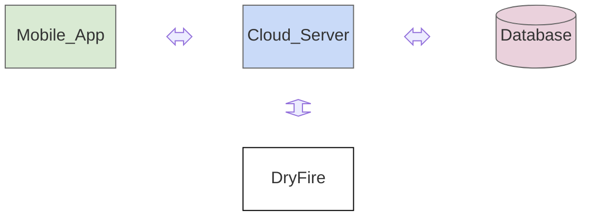
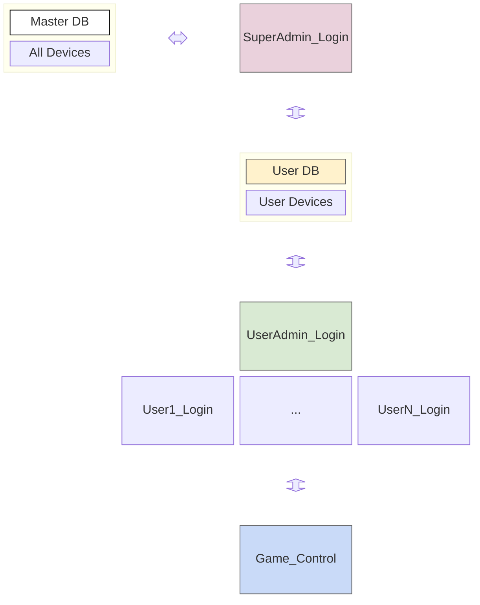
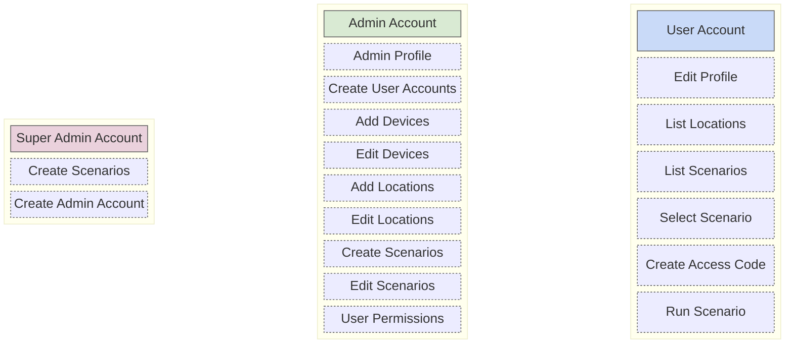

# CLOUD Server

## Component Overview

```mermaid
    block-beta
        columns 5
        Mobile_App blockArrowId1<[" "]>(x) Cloud_Server
        blockArrowId2<[" "]>(x)
        Database[("Database")]
        space:2 blockArrowId3<[" "]>(y)
        space:4 DryFire
        

        classDef APP fill:#d9ead3, stroke:#666666, stroke-width:1px, color:black;
        classDef CLD fill:#c9daf8, stroke:#666666, stroke-width:1px, color:black;
        classDef DTB fill:#ead1dc, stroke:#666666, stroke-width:1px, color:black;
        classDef DEV fill:#ffffff, stroke:black, stroke-width:1px, color:black;

        class Mobile_App APP
        class Cloud_Server CLD
        class Database DTB
        class DryFire DEV

```

## Thingsboard Hierarchy

```mermaid
    block-beta
    columns 4
        block SuperAdmin ["Master DB"]
            columns 1
            SA1["All Devices"]
        end

        blockArrowId1<[" "]>(x)

        SA_Login["SuperAdmin_Login"]

        space:3 blockArrowId2<[" "]>(y)

        space:3 block UserAdmin ["User DB"] 
            columns 1
            UA1["User Devices"]
        end

        space:3 blockArrowId3<[" "]>(y)

        space:3 UA_Login["UserAdmin_Login"]
        space:2 US1_Login["User1_Login"]

        US3_Login["..."]
        USN_Login["UserN_Login"]
        space:2 blockArrowId4<[" "]>(y)
        space:3 Game["Game_Control"]
        

        classDef APP fill:#d9ead3, stroke:#666666, stroke-width:1px, color:black;
        classDef GRN fill:#c9daf8, stroke:#666666, stroke-width:1px, color:black;
        classDef DTB fill:#ead1dc, stroke:#666666, stroke-width:1px, color:black;
        classDef DEV fill:#ffffff, stroke:black, stroke-width:1px, color:black;
        classDef YLW fill:#fff2cc, stroke:#666666, stroke-width:1px, color:black; 

        class UA_Login APP
        class UserAdmin YLW
        class SA_Login DTB
        class SuperAdmin DEV
        class Game GRN

```
 
 

## Accounts & Roles

```mermaid

    block-beta
        columns 6
        block
            columns 1
            SAdmin ["Super Admin Account"] 
            SAR2["Create Scenarios"]
            SAR3["Create Admin Account"]
        end

        space:1

        block
            columns 1
            Admin ["Admin Account"] 
            AR1["Admin Profile"]
            AR2["Create User Accounts"]
            AR3["Add Devices"]
            AR4["Edit Devices"]
            AR5["Add Locations"]
            AR6["Edit Locations"] 
            AR7["Create Scenarios"]
            AR8["Edit Scenarios"]
            AR9["User Permissions"]

        end

        space:1

        block
            columns 1
            User ["User Account"] 
            UR1["Edit Profile"]
            UR2["List Locations"]
            UR3["List Scenarios"]
            UR4["Select Scenario"]
            UR5["Create Access Code"]
            UR6["Run Scenario"]
        end
    


    classDef SAM fill:#ead1dc, stroke:#666666, stroke-width:1px, color:black
    classDef ADM fill:#d9ead3, stroke:#666666, stroke-width:1px, color:black
    classDef USR fill:#c9daf8, stroke:#666666, stroke-width:1px, color:black
    classDef OPS stroke:#666666, stroke-width:1px, color:black, stroke-dasharray: 2;
    classDef MOD fill:#ffffff, stroke:black, stroke-width:1px, color:black

    class SAdmin SAM
    class SAR2 OPS
    class SAR3 OPS


    class Admin ADM
    class AR1 OPS
    class AR2 OPS
    class AR3 OPS
    class AR4 OPS
    class AR5 OPS 
    class AR6 OPS
    class AR7 OPS
    class AR8 OPS
    class AR9 OPS

    class User USR
    class UR1 OPS
    class UR2 OPS
    class UR3 OPS
    class UR4 OPS
    class UR5 OPS
    class UR6 OPS

    
```

 
 
 
 

[Back to Main page](./README.md)