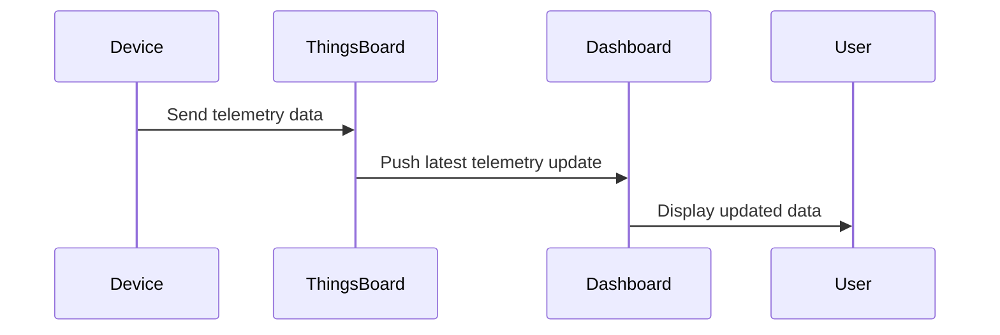
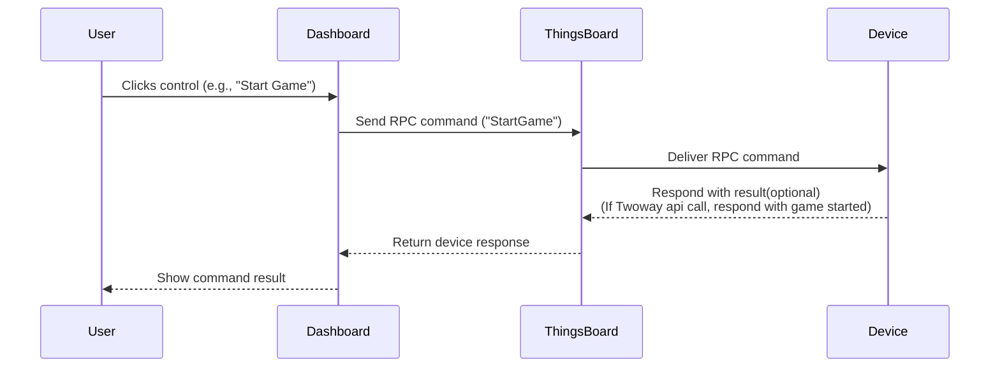

# **Device Communication**
How does a Web App or Dashboard Communicate with Devices via ThingsBoard? Read on.

 

# Table of Contents
[**Overview of Device Communication in ThingsBoard**](#overview-of-device-communication-in-thingsboard)

&nbsp; [Telemetry-Based Communication](#telemetry-based-communication)

&nbsp; [RPC-Based Communication](#rpc-based-communication)

[**How Dashboards and Web Apps Use These Mechanisms**](#how-dashboards-and-web-apps-use-these-mechanisms)

 

## Overview of Device Communication in ThingsBoard

ThingsBoard is an IoT platform that enables real-time monitoring and control of devices through dashboards and web applications. Communication between dashboards/web apps and devices is typically achieved via two main methods:

* **Telemetry:** Devices send data (e.g., Laser Hit count) to ThingsBoard, which is then visualized on dashboards.  
* **RPC (Remote Procedure Call):** Dashboards or apps send commands to devices (e.g., Config game, start game, stop game, get device info), and devices can also request data or actions from the platform.

 

### Telemetry-Based Communication

**What is Telemetry?**

Telemetry refers to time-series data sent from devices to ThingsBoard, such as laser hit or status updates. This data is stored, visualized, and can trigger alerts or further actions.

**Sequence Diagram: Telemetry Flow**

1. Device collects data (e.g., Laser hit).  
2. Device sends telemetry data to ThingsBoard (using MQTT).  
3. ThingsBoard stores the data and updates the database.  
4. Dashboard/Web App subscribes to telemetry updates and displays the latest data to users.

 

 

**Key Points:**

* Telemetry is typically one-way: device → platform → dashboard.  
* Dashboards can show real-time and historical data.

 

### RPC-Based Communication

**What is RPC?**

RPC allows ThingsBoard (and its dashboards) to send commands to devices and receive responses, enabling two-way communication. There are two main types:

* Server-side RPC: Dashboard/web app sends a command to the device (e.g., reboot, change state).  
* Client-side RPC: Device requests data or actions from the platform (e.g., get current time)

**Sequence Diagram: Server-Side RPC** (Dashboard to Device)

1. User clicks a control widget (e.g., button) on the dashboard.  
2. Dashboard sends an RPC command (e.g., "turnOn") to ThingsBoard.  
3. ThingsBoard forwards the RPC to the Device.  
4. Device executes the command and optionally sends a response.  
5. ThingsBoard relays the response back to the Dashboard.

 

 

**Key Points:**

* RPC can be one-way (no response expected) or two-way (response expected).  
* Used for remote control and configuration of devices.

 

## How Dashboards and Web Apps Use These Mechanisms

* **Telemetry Widgets:** Display real-time and historical device data, update automatically as new telemetry arrives.  
* **Control Widgets (RPC):** Allow users to send commands to devices (e.g., buttons, switches). Widgets can be configured to use specific RPC methods and parameters.  
* **Rule Engine:** Processes incoming telemetry and RPC messages, enabling automation, alerts, and integrations with external systems.

#### 

### 

[Back to Thingsboard Main Page](./Thingsboard.md)

[Back to Main page](../README.md)
