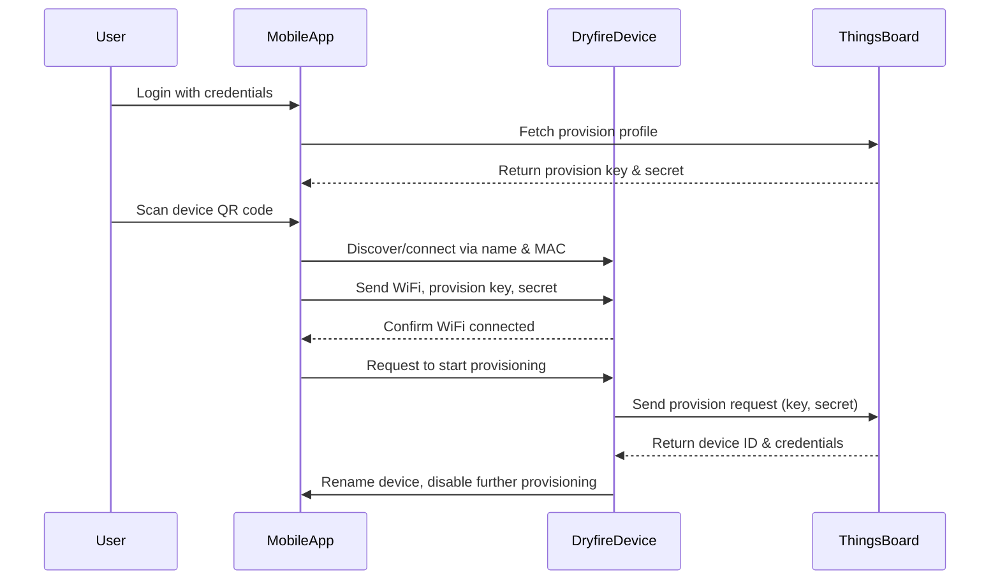

# **Device Management** {#device-management}

# Table of Contents
[**Provisioning Flow**](#provisioning-flow)

&nbsp; [Overview](#overview-1)

&nbsp; [Step-by-Step Provisioning Flow](#step-by-step-provisioning-flow)

&nbsp; [Key Points](#key-points)

[**TBD API calls and Device Message exchange**](#tbd-api-calls-and-device-message-exchange)

[**Game Flow**](#game-flow)

&nbsp; [Overview](#overview-2)

&nbsp; [API Authentication](#api-authentication)

&nbsp; [Data Format](#data-format)

&nbsp; [Stages and Functionality](#stages-and-functionality)

[**Configuration/Device Initialization Stage**](#configuration/device-initialization-stage)

&nbsp; [Game Stage](#game-stage)

&nbsp; [Generic Device Events](#generic-device-events)


<br>

## Provisioning Flow

### Overview

Provisioning is the process of securely registering a new Dryfire device with ThingsBoard, associating it with a user account, and enabling secure communication between the device, ThingsBoard, and the user’s web/mobile app.

### Step-by-Step Provisioning Flow

Step 1: User Login

* The user opens the Dryfire mobile app (either in a web browser or as a native app).  
* The user logs in with their ThingsBoard or Dryfire credentials.  
* On successful login, the app fetches the user's device provision profile, which includes:  
  * **Device Provision Key**  
  * **Device Secret Key**

Step 2: Scan Device QR Code

* The Dryfire device has a QR code containing its device name and MAC address.  
* The app provides an option to scan this QR code.  
* After scanning, the app extracts the device name and MAC address from the QR code.

Step 3: Connect to the Device

* The app starts scanning for nearby devices using the received device name and MAC address.  
* The Dryfire device is discovered and connected to the mobile app.

Step 4: Configure Device

* Through the app, the user sends the following information to the connected Dryfire device:  
  * **WiFi credentials (SSID and password)**  
  * **Device Provision Key**  
  * **Device Secret Key**  
* This configuration is a one-time update required for initial provisioning.

Step 5: Device Connects to WiFi

* The app instructs the Dryfire device to connect to the specified WiFi network.  
* On successful WiFi connection, the device is ready to communicate with ThingsBoard.

Step 6: Device Initiates Provision Request

* The Dryfire device uses the provision key and secret key to send a provisioning request to ThingsBoard (MQTT).  
* ThingsBoard validates the request and, upon success, issues a unique device ID (and access credentials).

Step 7: Finalize Provisioning

* The Dryfire device renames itself to the user’s chosen device name.  
* The device disables further provisioning unless its credentials are erased via the cloud or mobile app, ensuring secure onboarding.



### Key Points

* Provisioning is one-time: The device will not allow re-provisioning unless credentials are reset.  
* Secure onboarding: Only users with valid provision keys and secret keys can provision a device.  
* Seamless user experience: QR code scanning and app-driven configuration make onboarding fast and user-friendly.


<br>

## API calls and Device Message exchange
TBD

<br>

## Game Flow

### Overview

The DryFire game dashboard manages two stages: **Configuration/Device Initialization** and **Game**. It enables users to configure game sessions, start/stop games, monitor real-time device data (hits, status, Wi-Fi strength, ambient light), and view game history and scores.

### API Authentication

Obtain a JSON Web Token ($JWT\_TOKEN) via login:

```
curl -X POST \
  'https://thingsboard.cloud/api/auth/login' \
  -H 'accept: application/json' \
  -H 'Content-Type: application/json' \
  -d '{
    "username": "andrew.tam@gmail.com",
    "password": "dryfire2025"
  }'

```

### Data Format

**Device-to-Cloud Events**

* **Topic**: v1/devices/me/telemetry  
* **Payload Format**: JSON with a ts field at the root and a values object containing event data
* **Keys**:

| Key | Type | Description | Example Value | Appears in Event(s) |
| :---- | :---- | :---- | :---- | :---- |
| ts | Number | Unix epoch timestamp (seconds) | 1745922806 | All |
| deviceId | String | Device MAC address | 112233445566 | All |
| event | String | Event type | connect, hit, info, timeout, stop, disconnect | All |
| wifiStrength | Number | Wi-Fi signal strength (%) | 80 | connect, info |
| ambientLight | String | Light condition | good, average, poor | connect, info |
| gameId | String | Game session ID | GM-001 | hit, timeout, info, stop |
| hitCount | Number | Total hits in session | 25 | timeout, stop |
| gameStatus | String | Game status | idle, start, stop | info |

<br>

**Cloud-to-Device Commands**

* **Request Topic**: v1/devices/me/rpc/request/+  
* **Response Topic**: v1/devices/me/rpc/response/+  
* **Payload Format**: JSON with a ts field at the root and a values object containing command data.  
* **Keys**:

| Key | Type | Description | Example Value | Appears in Command(s) |
| :---- | :---- | :---- | :---- | :---- |
| ts | Number | Unix epoch timestamp (seconds) | 1745922806 | All |
| deviceId | String | Target device MAC address | 112233445566 | All |
| event | String | Command type | configure, start, stop, info | All |
| gameId | String | Game session ID | GM-001 | configure, start, stop |
| gameDuration | Number | Game duration (minutes) | 30 | configure |

<br>

## Stages and Functionality

### Configuration/Device Initialization Stage

**Purpose**  
Configure a game session by specifying game details and devices.

**Functionality**

* Users input a **Game Name**, select **Devices** (multi-select), and choose a **Game Duration** (15, 30, 45, or 60 minutes).  
* Sends a configure command to selected devices.  
* Transitions to the Game stage upon receiving info responses from devices.

**UI Components**

* Main Dashboard:  
  * Device Table: Displays columns: Device Name, deviceId, gameStatus (idle, start, stop), wifiStrength, ambientLight. Highlights active devices.  
  * New Game Button: Opens the Configuration Popup.  
  * Game History Table: Displays columns: created\_at, game\_id, game\_name, duration, \[device\_name\]\_hits.  
  * Score Graph: Bar chart of \[device\_name\]\_hits per game, updated based on Game History Table selection.  
* Configuration Popup:  
  * Fields: Game Name (text), Devices (checkboxes), Game Duration (dropdown: 15, 30, 45, 60 minutes).  
  * Buttons: Create Game, Cancel.

##
**Action: Press New Game Button**

* **Trigger**: User clicks **New Game** on the Main Dashboard.  
* **Cloud Sends**: None immediately; opens Configuration Popup.  
* **Topic**: N/A.  
* **API**: None.  
* **UI Update**: Displays the Configuration Popup.

##
**Action: Press Create Game Button**

* **Trigger**: User inputs **Game Name**, selects **Devices**, chooses **Game Duration**, and clicks **Create Game**.  
* **Cloud Sends** (for each selected device):  
  * **Payload**:

    ```
    {
    "ts": 1745922806,
    "values": {
        "deviceId": "53a601d0-484f-11f0-8baa-c9d27140f93d",
        "event": "configure",
        "gameId": "GM-001",
        "gameDuration": 30
    }
    }

    ```

* **Topic**: v1/devices/me/rpc/request/+  
* **API**:

    ```
    curl -X POST \
    'https://thingsboard.cloud/api/rpc/twoway/53a601d0-484f-11f0-8baa-c9d27140f93d' \
    -H 'accept: application/json' \
    -H 'Content-Type: application/json' \
    -H 'X-Authorization: Bearer $JWT_TOKEN' \
    -d '{
        "method": "configure",
        "params": {
        "ts": 1745922806,
        "values": {
            "deviceId": "53a601d0-484f-11f0-8baa-c9d27140f93d",
            "event": "configure",
            "gameId": "GM-001",
            "gameDuration": 30
        }
        }
    }'
    ```

* **Device Response**:  
  * **Payload**:

    ```
    {
    "ts": 1745922806,
    "values": {
        "deviceId": "53a601d0-484f-11f0-8baa-c9d27140f93d",
        "event": "info",
        "gameId": "GM-001",
        "gameStatus": "idle",
        "wifiStrength": 80,
        "ambientLight": "good"
    }
    }

    ```

    **Topic:** v1/devices/me/rpc/response/$request\_id

* **UI Update:**  
  * Updates Device Table: Sets gameStatus to idle, updates wifiStrength and ambientLight for each device.  
  * Transitions to the Game Window (new dashboard state).  
  * Displays an error popup (5-second cooldown) if no devices respond or inputs are invalid.  
* **Error Handling:**  
  * If no devices are selected or inputs are invalid: Displays a popup with "No devices selected" or "Invalid inputs".  
  * If a device fails to respond: Displays a popup with "Device \[deviceId\] failed to respond".

<br>

### Game Stage

**Purpose**  
Manage an active game session, track hits, and save game history.

**Functionality**

* Start/stop the game, monitor hitCount, gameStatus, wifiStrength, and ambientLight.  
* Update telemetry with hit counts on each hit event.  
* Save final game history on stop or timeout events.  
* Periodically request device information.

**UI Components**

* **Game Window** (dashboard state):  
* **Device Cards**: Display Device Name, deviceId, gameStatus, wifiStrength, ambientLight, hitCount. Highlights active (start) and inactive (idle, stop) states with shadow effects.  
* **Buttons**: **Start Game**, **Stop Game**, **Back**.

##
**Action: Press Start Game Button**:

* **Trigger**: User clicks **Start Game** in the Game Window.  
* **Cloud Sends** (for each configured device):  
  * **Payload**:

    ```
    {
    "ts": 1745922806,
    "values": {
        "deviceId": "53a601d0-484f-11f0-8baa-c9d27140f93d",
        "event": "start",
        "gameId": "GM-001"
    }
    }
    ```
    **Topic:** v1/devices/me/rpc/request/+

* **API**

    ```
    curl -X POST \
    'https://thingsboard.cloud/api/rpc/twoway/53a601d0-484f-11f0-8baa-c9d27140f93d' \
    -H 'accept: application/json' \
    -H 'Content-Type: application/json' \
    -H 'X-Authorization: Bearer $JWT_TOKEN' \
    -d '{
        "method": "start",
        "params": {
        "ts": 1745922806,
        "values": {
            "deviceId": "53a601d0-484f-11f0-8baa-c9d27140f93d",
            "event": "start",
            "gameId": "GM-001"
        }
        }
    }'

    ```


* **Device Response**  
  * **Payload**

    ```
    {
    "ts": 1745922806,
    "values": {
        "deviceId": "53a601d0-484f-11f0-8baa-c9d27140f93d",
        "event": "start",
        "gameId": "GM-001",
        "gameStatus": "start"
    }
    }

    ```
    **Topic**: v1/devices/me/rpc/response/$request\_id

**UI Update**:

* Updates Device Cards: Sets gameStatus to start, highlights active state.  
* Initializes hitCount to 0 for each device.  
* Displays an error popup if any device fails to respond.

##
**Action: Periodic Info Request (While Game is Active)**:

* **Trigger**: Periodic request (every 5 seconds) by the Rule Engine.  
* **Cloud Sends**:  
  * **Payload**:

    ```
    {
    "ts": 1745922806,
    "values": {
        "deviceId": "53a601d0-484f-11f0-8baa-c9d27140f93d",
        "event": "info",
        "gameId": "GM-001"
    }
    }
    ```

  **Topic**: v1/devices/me/rpc/request/+


* **API**:

    ```
    curl -X POST \
    'https://thingsboard.cloud/api/rpc/twoway/53a601d0-484f-11f0-8baa-c9d27140f93d' \
    -H 'accept: application/json' \
    -H 'Content-Type: application/json' \
    -H 'X-Authorization: Bearer $JWT_TOKEN' \
    -d '{
        "method": "info",
        "params": {
        "ts": 1745922806,
        "values": {
            "deviceId": "53a601d0-484f-11f0-8baa-c9d27140f93d",
            "event": "info",
            "gameId": "GM-001"
        }
        }
    }'
    ```

* **Device Response:**  
  * **Payload:**

    ```
    {
    "ts": 1745922806,
    "values": {
        "deviceId": "53a601d0-484f-11f0-8baa-c9d27140f93d",
        "event": "info",
        "gameId": "GM-001",
        "gameStatus": "start",
        "wifiStrength": 80,
        "ambientLight": "good"
    }
    }

    ```

    **Topic**: v1/devices/me/rpc/response/$request\_id  
    *   
* **UI Update**  
  * Updates Device Cards: Refreshes gameStatus, wifiStrength, and ambientLight.

##
**Action: Target Hit (Asynchronous)**:

* **Trigger**: Device sends a hit event.  
* **Device Sends**:  
  * **Payload**:

    ```
    {
    "ts": 1745922806,
    "values": {
        "deviceId": "53a601d0-484f-11f0-8baa-c9d27140f93d",
        "gameId": "GM-001",
        "event": "hit"
    }
    }
    ```

  **Topic**: v1/devices/me/telemetry

* **UI Update:**  
  * Increments hitCount for the device on its Device Card (e.g., hitCount++).  
  * Updates in real-time via WebSocket.

##
**Action: Press Stop Game Button:**

* **Trigger:** User clicks Stop Game in the Game Window.  
* **Cloud Sends:**  
  * **Payload:**

    ```
    {
    "ts": 1745922806,
    "values": {
        "deviceId": "53a601d0-484f-11f0-8baa-c9d27140f93d",
        "event": "stop",
        "gameId": "GM-001"
    }
    }
    ```

  **Topic**: v1/devices/me/rpc/request/+

* **API**

    ```
    curl -X POST \
    'https://thingsboard.cloud/api/rpc/twoway/53a601d0-484f-11f0-8baa-c9d27140f93d' \
    -H 'accept: application/json' \
    -H 'Content-Type: application/json' \
    -H 'X-Authorization: Bearer $JWT_TOKEN' \
    -d '{
        "method": "stop",
        "params": {
        "ts": 1745922806,
        "values": {
            "deviceId": "53a601d0-484f-11f0-8baa-c9d27140f93d",
            "event": "stop",
            "gameId": "GM-001"
        }
        }
    }'

    ```


* **Device Response:**  
  * **Payload:**

    ```
    {
    "ts": 1745922806,
    "values": {
        "deviceId": "53a601d0-484f-11f0-8baa-c9d27140f93d",
        "gameId": "GM-001",
        "event": "stop",
        "hitCount": 25
    }
    }
    ```

    **Topic**: v1/devices/me/rpc/response/$request\_id

* **UI Update**:  
  * Updates Device Cards: Sets gameStatus to stop, displays final hitCount.  
  * Saves game history to the database.  
  * Returns to the Main Dashboard, refreshing the Game History Table and Score Graph.

##
**Action: Game Timeout**:

* **Trigger:** Device detects timeout based on gameDuration.  
* **Device Sends:**  
  * **Payload:**

    ```
    {
    "ts": 1745922806,
    "values": {
        "deviceId": "53a601d0-484f-11f0-8baa-c9d27140f93d",
        "gameId": "GM-001",
        "event": "timeout",
        "hitCount": 25
    }
    }

    ```

    **Topic**: v1/devices/me/telemetry

* **UI Update:**  
  * Same as Stop Game: Updates gameStatus to stop, saves game history, returns to the Main Dashboard, and refreshes the Game History Table and Score Graph.

##
**Action: Press Back Button**:

* **Trigger:** User clicks Back in the Game Window.  
* **Cloud Sends (if game is running):**  
  * **Payload:**

    ```
    {
    "ts": 1745922806,
    "values": {
        "deviceId": "53a601d0-484f-11f0-8baa-c9d27140f93d",
        "event": "stop",
        "gameId": "GM-001"
    }
    }
    ```
    **Topic**: v1/devices/me/rpc/request/+

    * **API**: Same as Stop Game API.  
* **Device Response**  
  * Same as Stop Game response (stop event with hitCount).  
* **UI Update**  
  * Saves game history if the game was running.  
  * Returns to the Main Dashboard, refreshing the Game History Table and Score Graph.

### Generic Device Events
##
**Connect (Power-On/Restart):**

* **Trigger:** Device connects to the MQTT broker.  
* **Device Sends:**  
  * **Payload:**

    ```
    {
    "ts": 1745922806,
    "values": {
        "deviceId": "53a601d0-484f-11f0-8baa-c9d27140f93d",
        "event": "connect",
        "wifiStrength": 80,
        "ambientLight": "good"
    }
    }
    ```

    **Topic**: v1/devices/me/telemetry

* **UI Update:**  
  * Updates Device Table (Main Dashboard) and Device Cards (Game Window): Sets gameStatus to idle, updates wifiStrength and ambientLight, highlights active state.  

* **Note**  
  * An event is not expected because devices only disconnect due to power-off or abrupt restart, preventing them from sending telemetry.  
  * If a device stops sending data (e.g., no info events), the dashboard sets gameStatus to offline and highlights the inactive state.

##
**Info (Alive Packet)**:

* **Trigger:** Device periodically sends an "info" RPC request (one-way) to report its status (e.g., every few seconds or as configured).  
* **Device Sends:**  
  * **Payload:**
    ```
    {
    "ts": 1745922806,
    "values": {
        "deviceId": "53a601d0-484f-11f0-8baa-c9d27140f93d",
        "event": "info",
        "gameId": "GM-001",
        "gameStatus": "idle",
        "wifiStrength": 80,
        "ambientLight": "good"
    }
    }
    ```

    **Topic**: v1/devices/me/rpc/request/+

## 

[Back to Thingsboard Main Page](./Thingsboard.md)

[Back to Main page](../README.md)
