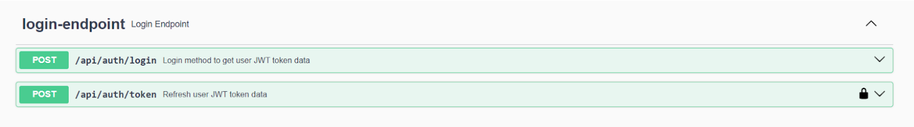
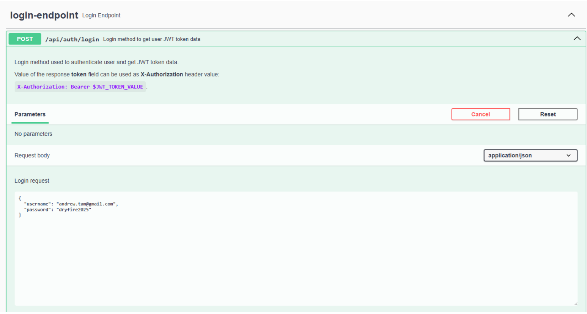
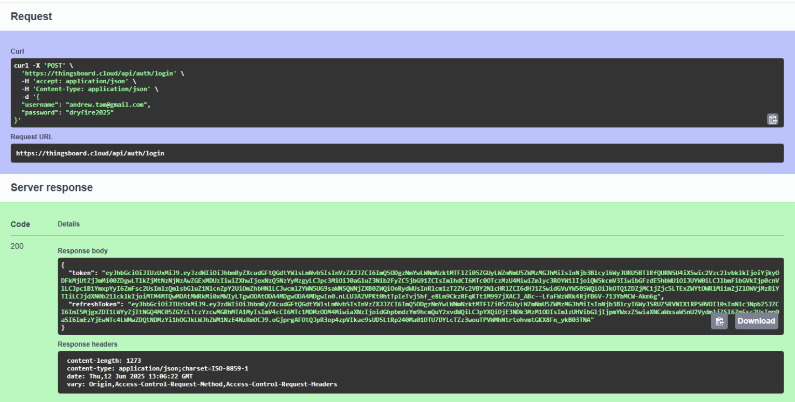
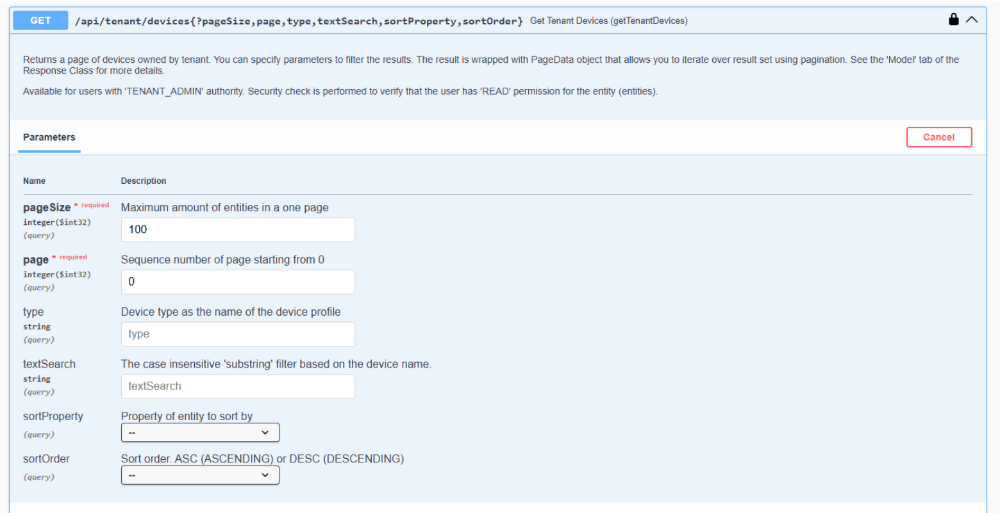
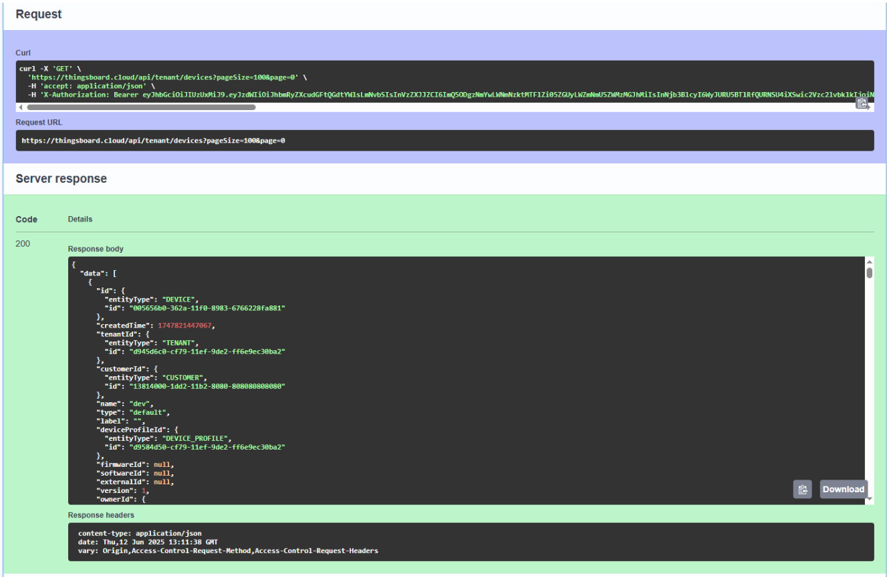
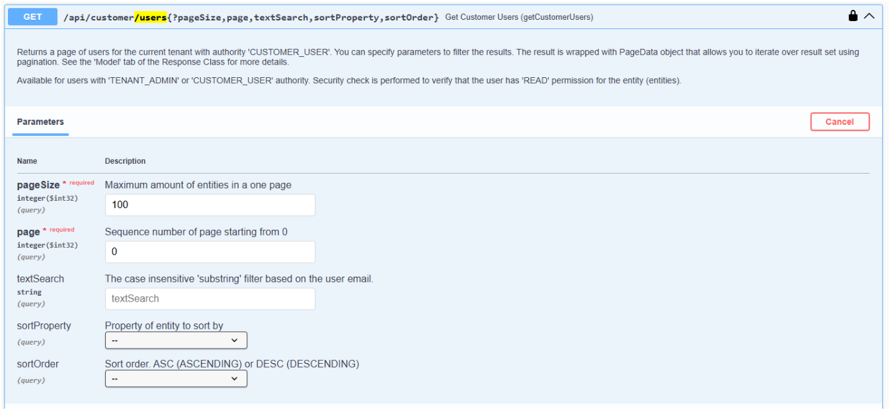
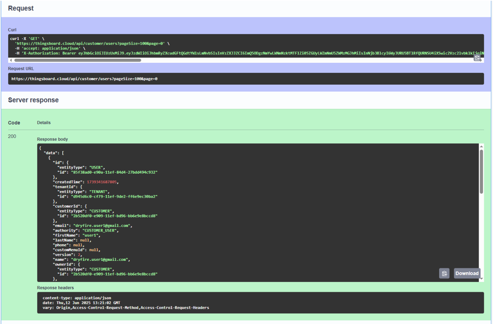
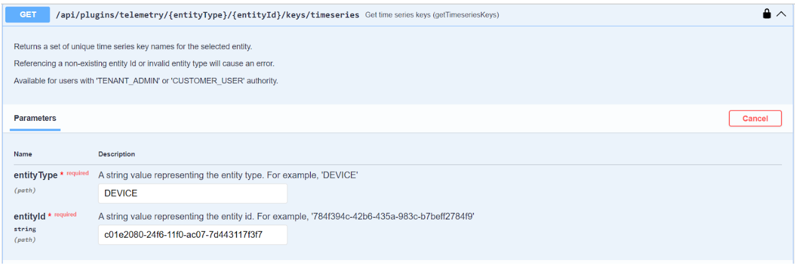
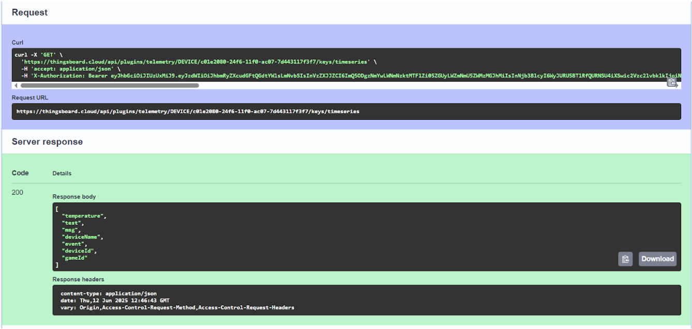

# **Using Thingsboard and Swagger UI** 
Let’s start Thingsboard exploration with **Swagger UI**.  
Since we are using the **ThingsBoard Cloud** version, a custom IP and port are not required.

Access Swagger UI here:  
 🔗 [https://thingsboard.cloud/swagger-ui/](https://thingsboard.cloud/swagger-ui/)

Refer to the official documentation for authentication steps:  
 🔗 [https://thingsboard.io/docs/reference/rest-api/](https://thingsboard.io/docs/reference/rest-api/)

**Login Credentials:**

* **Username:** andrew.tam@gmail.com  
* **Password:** dryfire2025

Once logged in, you can access and test all available APIs directly in Swagger.

\[*Note: The same API testing can also be done using **Postman**, but note that API calls must be manually configured in Postman.\]*

 

# Table of Contents
[Example API usage](#example-api-usage)

[Login API](#login-api)

[Get All Device List](#get-all-device-list)

[Get All User List](#get-all-user-list)

[Get all Telemetry Data of a device](#get-all-telemetry-data-of-a-device)

[Based on Device ID](#based-on-device-id)

 

## Example API usage

#### **Login API**

Login API call  

Enter login credential in json format  

Click `execute`

On success, token will be received

## Get All Device List

## Get All User List

## Get all Telemetry Data of a device

### Based on Device ID

##

[Back to Thingsboard Main Page](./Thingsboard.md)

[Back to Main page](../README.md)
