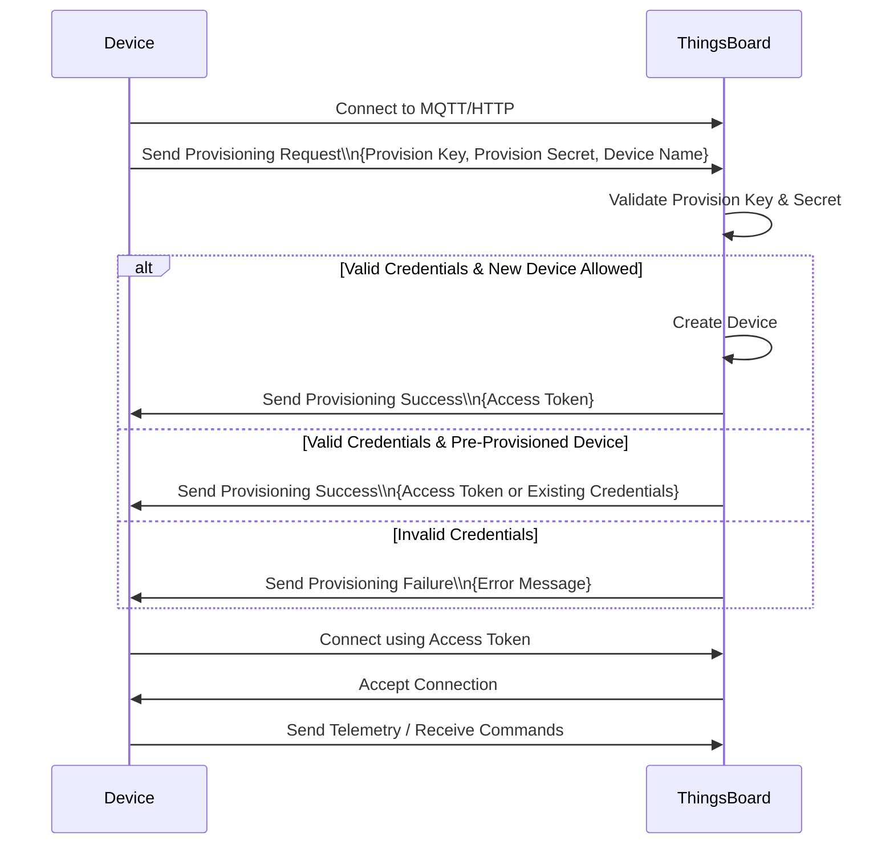

# **Setting Up MQTTX for Testing**
This section explains how to configure **MQTTX** to simulate DryFire game devices for testing the ThingsBoard Cloud Dashboard without physical hardware. By establishing MQTT connections, you can subscribe to command topics, send telemetry data, and respond to RPC requests to mimic device behavior.

<br>

# Table of Contents
[Prerequisites](#Prerequisites)

[Configuration Steps](#Configuration-Steps)

[Sent Telemetry Data to a device](#sent-telemetry-data-to-a-device)

[Based on Device access Token](#based-on-device-access-token)

[Provision Devices](#provision-devices)

[Device profile configuration](#device-profile-configuration)

<br>


## Prerequisites

* Install **MQTTX** (available for Windows, macOS, and Linux) from [https://mqttx.app/](https://mqttx.app/)
* Ensure an active internet connection to connect to thingsboard.cloud

<br>

**Device Details**

| Device Name | Device ID | Access Token |
| :---- | :---- | :---- |
| Dryfire-1 | 53a601d0-484f-11f0-8baa-c9d27140f93d | LwhPokVWnbsbzN6IZG6q |
| Dryfire-2 | 62273bc0-484f-11f0-b50e-99d9c8fcd8e7 | ue86jHgD4IfbPUhFx9rY |
| Dryfire-3 | 7518ef30-484f-11f0-add2-093f841cc5dc | 5cJBGUGd9PERjLcQGjHE |
| Dryfire-4 | b2a88740-48f2-11f0-add2-093f841cc5dc | w80o6q2THI5147BOgqnH |

<br>

## Configuration Steps

* **Open MQTTX**:  
  * Launch the MQTTX application on your computer.  
* **Create a Connection for Each Device**:  
  * For each device (e.g., Dryfire-1, Dryfire-2), create a new connection:  
    * Click **New Connection** in MQTTX.  
    * Set the connection parameters:  
      * **Name**: Device name (e.g., Dryfire-1) for easy identification.  
      * **Host**: mqtt://thingsboard.cloud  
      * **Port**: 1883 (default MQTT port)  
      * **Username**: Access Token (e.g., LwhPokVWnbsbzN6IZG6q for Dryfire-1)  
      * **Password**: Leave blank (not required)  
      * **Protocol**: Select mqtt  
    * Save and click **Connect**. Repeat for all devices.  
* **Subscribe to Command Topics**:  
  * For each connected device in MQTTX:  
    * Select the device connection.  
    * Add a subscription to the topic: v1/devices/me/rpc/request/+  
    * This enables the simulated device to receive commands (configure, start, stop, info) from ThingsBoard Cloud.  
* **Respond to RPC Commands**:  
  * When an RPC command is received on v1/devices/me/rpc/request/\<request\_id\>, respond to simulate device behavior:  
    * Note the request\_id from the received topic (e.g., v1/devices/me/rpc/request/123).  
    * Set the **Publish Topic** to: v1/devices/me/rpc/response/\<request\_id\> (e.g., v1/devices/me/rpc/response/123).  
    * Use the appropriate JSON payload (example for Dryfire-1 responding to a start command with an info event):

        ```
        {
            "ts": 1745922806,
            "values": {
                "deviceId": "53a601d0-484f-11f0-8baa-c9d27140f93d",
                "event": "info",
                "gameId": "GM-001",
                "gameStatus": "start"
            }
        }
        ```

    * Click **Publish** to send the response. Refer to Section 2.2 for command-specific response formats.

<br>

**Note**
* One-way RPCs can be used instead of two-way RPCs for commands where no response is required (e.g., configure, start, stop, info).  
* **API Example** (for a one-way start command):

    ```
    curl -X POST \
    'https://thingsboard.cloud/api/rpc/oneway/53a601d0-484f-11f0-8baa-c9d27140f93d' \
    -H 'accept: application/json' \
    -H 'Content-Type: application/json' \
    -H 'X-Authorization: Bearer $JWT_TOKEN' \
    -d '{
        "method": "start",
        "params": {
        "ts": 1745922806,
        "values": {
            "deviceId": "53a601d0-484f-11f0-8baa-c9d27140f93d",
            "event": "start",
            "gameId": "GM-001"
        }
        }
    }'
    ```

<br>

## Sent Telemetry Data to a device

### Based on Device access Token

```
curl \-v \-X POST \-d @telemetry-data-with-ts.json https://demo.thingsboard.io/api/v1/$ACCESS\_TOKEN/telemetry \--header "Content-Type:Sample/json"

Sample Json Data
{  
  "ts": 1745922806,
  "values": {
    	"deviceId": "112233445566",
	"event": "info",
	"gameId": 1234,
	"gameStatus": ""ideal"
	  
    }  
}
```


## Provision Devices

Note: Devices are provisioned without Certificates in ThingsBoard

<br>


<br>

1. Get a Provision Key and Secret:  
   * In ThingsBoard, you create or open a device profile (which is like a template for your devices).  
   * You enable provisioning on that profile and get a Provision Key and Provision Secret — think of these as a username and password for your devices to prove they are allowed to register.  
2. Device Sends a Provisioning Request:  
   * When your device starts for the first time, it sends a message to ThingsBoard saying:  
     * "Here is my Provision Key and Secret."  
     * "My name is XYZ." (optional)  
     * "Here are my credentials." (optional, or leave blank)  
3. ThingsBoard Checks the Request:  
   * ThingsBoard looks at the key and secret to see if the device is allowed to register.  
   * Depending on your provisioning settings, it will either:  
     * Create a new device if the name is new, or  
     * Allow only devices that were already created in ThingsBoard but not yet provisioned.  
4. ThingsBoard Responds:  
   * If everything is okay, ThingsBoard sends back credentials (usually an Access Token) for the device to use next time it connects.  
   * If the device already sent credentials, ThingsBoard accepts those.  
5. Device Connects and Works:  
   * The device uses the Access Token to connect securely and start sending data.

## Device profile configuration

You should configure the device profile to enable provisioning feature, collect provision device key and provision device secret.

* You can either create a new device profile or open the existing one. To create a new one you should open the Device profiles page and click on the "+" icon in the table header.  
* Input a name of the new device profile and click on Step 4 of the "Add device profile" wizard. We will use the name "Device Provisioning Test" in this example. However, typically this should be your device model or similar.

* Choose one of the provisioning strategies, copy the provisioning key and secret, and finally click "Add".

    ```
    host : thingsboard.cloud
    port : 1883
    Connecting with username: provision
    MQTT connection to thingsboard server, to create provisioning request
    ```
    
    **Example of a Provisioning Request (what the device sends):**
    ```
    Topic : /provision/request
    json
    {
        "deviceName": "Dryfire-4",
        "provisionDeviceKey": "YOUR\_PROVISION\_KEY",
        "provisionDeviceSecret": "YOUR\_PROVISION\_SECRET"
    }
    ```

    **Example of a Successful Response (what ThingsBoard sends back):**
    ```
    Topic : /provision/response
    json
    {
        "provisionDeviceStatus": "SUCCESS",
        "credentialsType": "ACCESS\_TOKEN",
        "accessToken": "abcdef123456"
    }
    ```

##

[Back to Thingsboard Main Page](./Thingsboard.md)

[Back to Main page](../README.md)
