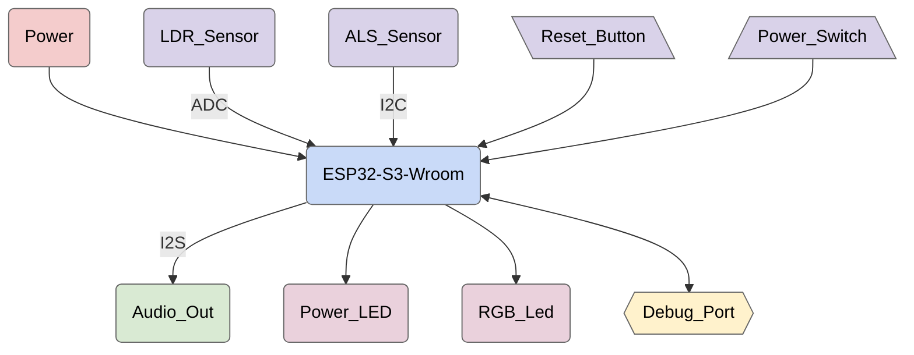

# Harware

## Block Diagram

```mermaid
graph TD
    classDef PWR fill:#f4cccc, stroke:#666666, stroke-width:1px, color:black;
    classDef MCU fill:#c9daf8, stroke:#666666, stroke-width:1px, color:black;
    classDef LED fill:#ead1dc, stroke:#666666, stroke-width:1px, color:black; 
    classDef DBG fill:#fff2cc, stroke:#666666, stroke-width:1px, color:black; 
    classDef INP fill:#d9d2e9, stroke:#666666, stroke-width:1px, color:black; 
    classDef OUT fill:#d9ead3, stroke:#666666, stroke-width:1px, color:black; 

    
    %% Power Section
    Power(Power)

    %% Microcontroller
    ESP32-S3-Wroom(ESP32-S3-Wroom)

    %% Inputs
    LDR_Sensor(LDR_Sensor)
    ALS_Sensor(ALS_Sensor)
    Reset_Button[\Reset_Button\]
    Power_Switch[/Power_Switch\]

    %% Outputs
    Power_LED(Power_LED)
    RGB_Led(RGB_Led)
    Audio_Out(Audio_Out)
    
    %% Debug
    Debug_Port{{Debug_Port}}

    class Power PWR;
    class ESP32-S3-Wroom MCU;

    class LDR_Sensor INP;
    class ALS_Sensor INP;
    class Reset_Button INP;
    class Power_Switch INP;

    class Audio_Out OUT;
    class Power_LED LED;
    class RGB_Led LED;

    class Debug_Port DBG;
    
    Power --> ESP32-S3-Wroom
    LDR_Sensor -- ADC --> ESP32-S3-Wroom
    ALS_Sensor -- I2C --> ESP32-S3-Wroom
    ESP32-S3-Wroom -- I2S --> Audio_Out
    ESP32-S3-Wroom --> Power_LED
    ESP32-S3-Wroom --> RGB_Led
    Reset_Button --> ESP32-S3-Wroom
    Power_Switch --> ESP32-S3-Wroom
    ESP32-S3-Wroom <--> Debug_Port

```
 
 
 
 

[Back to Main page](./README.md)