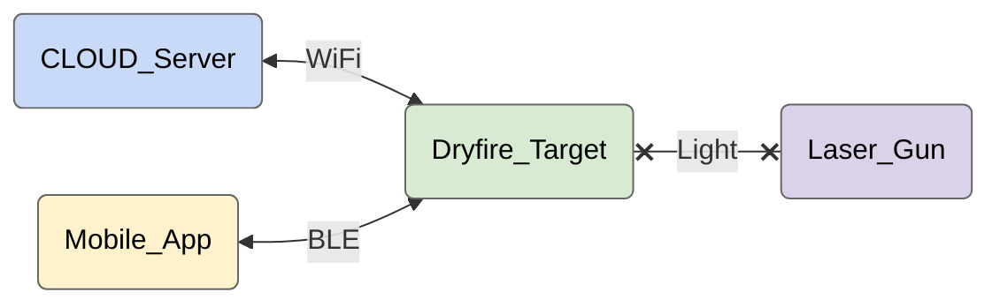

# Dryfire System Architecture

# Intro
Dryfire is a target practice device designed to be used in academy's for mock training and at homes for fun.

 

# System Diagram

 

# Usecases
## Initialization
- User should see an LED indication when he switches ON the device
- User should be able to find the current state of the device from it's LED indication
- User should be able to reset the device using the reset button

## Provisioning
- User should be able to provision the device with ID, WiFi and CLOUD settings via a Mobile_App
- User should be able to factory reset the device using the reset button

## Gaming & Monitoring
- User should be able to setup the device to be part of a game using a Mobile app via the CLOUD
- User should be dynamically activate or deactivate the device as a part of a game scenario
- When the user hits the target accurately with the laser provide a light and buzzer indication
- User should be able to check the status of the device or game in the CLOUD dashboard
- User should be able to use the device both indoors and outdoors

 

# Sequence Diagrams
- [Sequence Diagrams](./SEQ.md)

 

# Harware
- [Hardware Block Diagram](./HBD.md)

 

# Firmware
- [Software Block Diagram](./SBD.md)

 

# Cloud Backend
- [CLOUD Architecture](./CLOUD.md)
- [Thingsboard](./Cloud/Thingsboard.md)

 

# Mobile Backend
...
