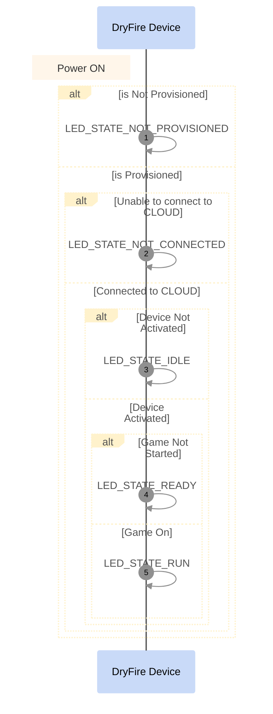

# US2: LED Indication

## Sequence Diagram

```mermaid

%%{
  init: {
    'theme': 'base',
    'themeVariables': {
        'actorBkg': '#c9daf8',
        'actorBorder': '#c9daf8',
        'actorTextColor': 'black',
        'actorLineColor': '#545454',
        'signalColor': '#909090',
        'signalTextColor': '#545454',
        'labelBoxBkgColor': '#fff2cc',
        'labelBoxBorderColor': '#fff2cc',
        'labelTextColor': '#545454',
        'loopTextColor': '#545454',
        'activationBorderColor': '#d9ead3',
        'activationBkgColor': '#d9ead3',
        'sequenceNumberColor': 'black',
        'noteBkgColor': '#fff6ea',
        'noteBorderColor': '#fff6ea',
        'noteTextColor': '545454'
    }
  }
}%%

sequenceDiagram

    autonumber
    participant A as DryFire Device
    
    Note left of A: Power ON
    alt is Not Provisioned
        A ->> A: LED_STATE_NOT_PROVISIONED
    else is Provisioned
        alt Unable to connect to CLOUD
            A ->> A: LED_STATE_NOT_CONNECTED
        else Connected to CLOUD
            alt Device Not Activated
                A ->> A: LED_STATE_IDLE
            else Device Activated
                alt Game Not Started
                    A ->> A: LED_STATE_READY
                else Game On
                    A ->> A: LED_STATE_RUN
                end
            end
        end
    end
    

    
```

 
 
 
 

[Back](./SEQ.md)