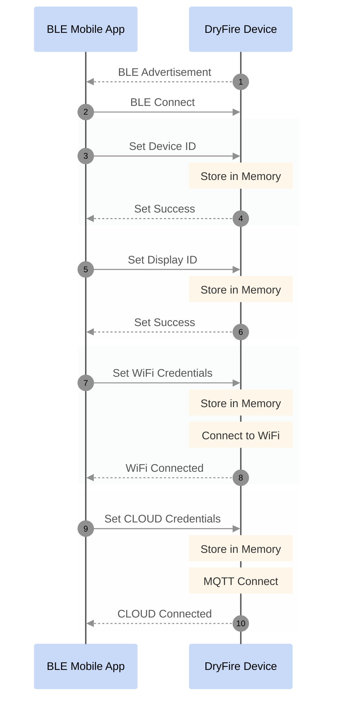

# US4: Provisioning

## Sequence Diagram

```mermaid

%%{
  init: {
    'theme': 'base',
    'themeVariables': {
        'actorBkg': '#c9daf8',
        'actorBorder': '#c9daf8',
        'actorTextColor': 'black',
        'actorLineColor': '#545454',
        'signalColor': '#909090',
        'signalTextColor': '#545454',
        'labelBoxBkgColor': '#fff2cc',
        'labelBoxBorderColor': '#fff2cc',
        'labelTextColor': '#545454',
        'loopTextColor': '#545454',
        'activationBorderColor': '#d9ead3',
        'activationBkgColor': '#d9ead3',
        'sequenceNumberColor': 'black',
        'noteBkgColor': '#fff6ea',
        'noteBorderColor': '#fff6ea',
        'noteTextColor': '545454'
    }
  }
}%%

sequenceDiagram

    autonumber
    participant A as BLE Mobile App
    participant B as DryFire Device
    
    B-->>A: BLE Advertisement
    A->>B: BLE Connect

    rect rgb(250, 252, 253, 0.75)
    A->>B: Set Device ID
    Note over B: Store in Memory
    B-->>A: Set Success
    end
    
    rect rgb(250, 252, 253, 0.25)
    A->>B: Set Display ID
    Note over B: Store in Memory
    B-->>A: Set Success
    end

    rect rgb(250, 252, 253, 0.75)
    A->>B: Set WiFi Credentials
    Note over B: Store in Memory
    Note over B: Connect to WiFi
    B-->>A: WiFi Connected
    end
    
    rect rgb(250, 252, 253, 0.25)
    A->>B: Set CLOUD Credentials
    Note over B: Store in Memory
    Note over B: MQTT Connect
    B-->>A: CLOUD Connected
    end

    

    
```

 
 
 
 

[Back](./SEQ.md)