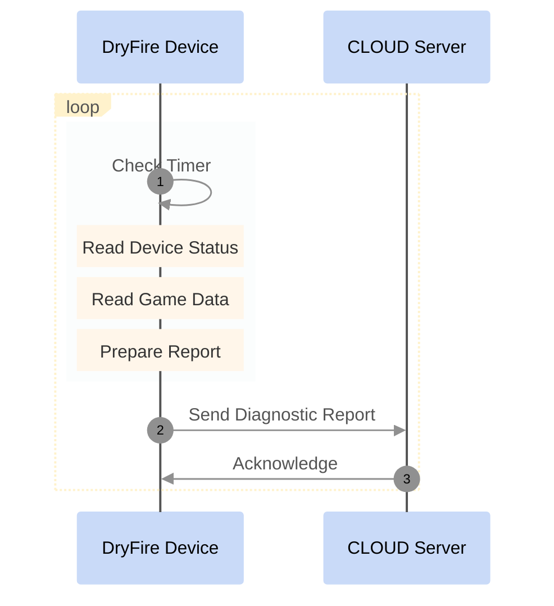

# US9: Monitoring

## Sequence Diagram

```mermaid

%%{
  init: {
    'theme': 'base',
    'themeVariables': {
        'actorBkg': '#c9daf8',
        'actorBorder': '#c9daf8',
        'actorTextColor': 'black',
        'actorLineColor': '#545454',
        'signalColor': '#909090',
        'signalTextColor': '#545454',
        'labelBoxBkgColor': '#fff2cc',
        'labelBoxBorderColor': '#fff2cc',
        'labelTextColor': '#545454',
        'loopTextColor': '#545454',
        'activationBorderColor': '#d9ead3',
        'activationBkgColor': '#d9ead3',
        'sequenceNumberColor': 'black',
        'noteBkgColor': '#fff6ea',
        'noteBorderColor': '#fff6ea',
        'noteTextColor': '545454'
    }
  }
}%%

sequenceDiagram

    autonumber
    participant A as DryFire Device
    participant B as CLOUD Server
    

    loop 
        rect rgb(250, 252, 253, 0.75)
        A->>A: Check Timer
            Note over A: Read Device Status
            Note over A: Read Game Data
            Note over A: Prepare Report
        end
        A->>B: Send Diagnostic Report
        B->>A: Acknowledge
    end

    
    

    
```

 
 
 
 

[Back](./SEQ.md)